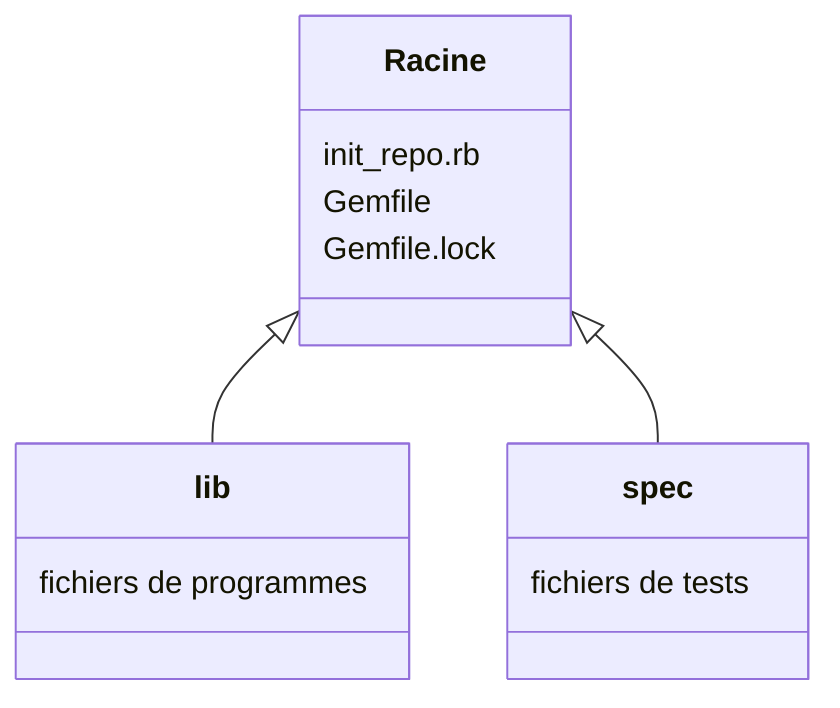

# Organiseur de fichiers

Ce repository sert d'entrainement pour créer des dossier et des gemfiles
automatiquement avec **Ruby**.

Le but ici est de suivre le cours de [The Hacking Project](https://www.thehackingproject.org/fr/dashboard/courses/4/weeks/3/days/5) sur le sujet.

## Structure

Chacun des dossiers dans ce repository aura été créé par le programme `init_repo.rb`
situé à la racine du projet. Ce que je peux faire ensuite par exemple, c'est
automatiser l'exécution de ce fichier quand j'initialise un repository.
Ce n'est pas encore le cas, mais j'espère arriver à cette possibilité !

## Fonctionnement

Quand j'exécute le fichier, un `Gemfile` est créé avec toutes les gems de base qui
m'intéressent et la commande système `bundle install` est lancée tout de suite après.
Je peux aussi initialiser `rspec` automatiquement, et créer l'architecture de mon
repo en faisant un dossier `lib` où je range mes fichiers de programmes.

